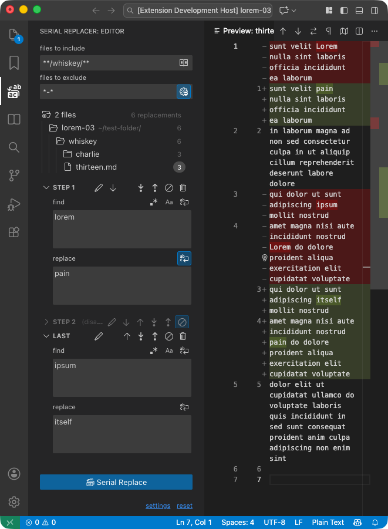

# Serial Replacer

> Visual Studio Code extension that provides apowerful  **find-and-replace** solution. It allows you to perform **consecutive replacements** by defining **steps with search patterns** — either regular expressions or plain text — and substitution text. You can filter the target files by inclusion and exclusion **filters** and a file tree to **preview** the changes. It works across open editors, multiple folders, or entire workspaces.

## Features

- Replacement steps
  - Add above and below
  - Change order up and down
  - Disable and delete
  - Rename description
  - Word wrap
- Find
  - Use regular expression or plain text
  - Case sensitive
- Files
  - Files to include (using glob patterns)
  - Files to exclude (using glob patterns)
  - Use current open editors or current workspace
  - Preview file tree
- Internationalization
  - Also available in Brazilian Portuguese

## More info

- [Visual Studio Marketplace](https://marketplace.visualstudio.com/items?itemName=blagus.serial-replacer) extension homepage (for instalation)
- [Github](https://github.com/lexblagus/vscode-serial-replacer) source code

Made with ♥ by [Lexa Blagus](https://blag.us/)

## Legal

This project is licensed under the [Creative Commons Attribution-NonCommercial-ShareAlike 4.0 International (CC BY-NC-SA 4.0)](./LICENSE.txt). You are free to share and adapt this project **non-commercially**, as long as you **give appropriate credit to *Lexa Blagus \<https://blag.us\>*** and **distribute your contributions under the same license**.

This extension uses visual elements derived from [Microsoft Codicons](https://github.com/microsoft/vscode-codicons), licensed under [CC BY 4.0](https://creativecommons.org/licenses/by/4.0/).
