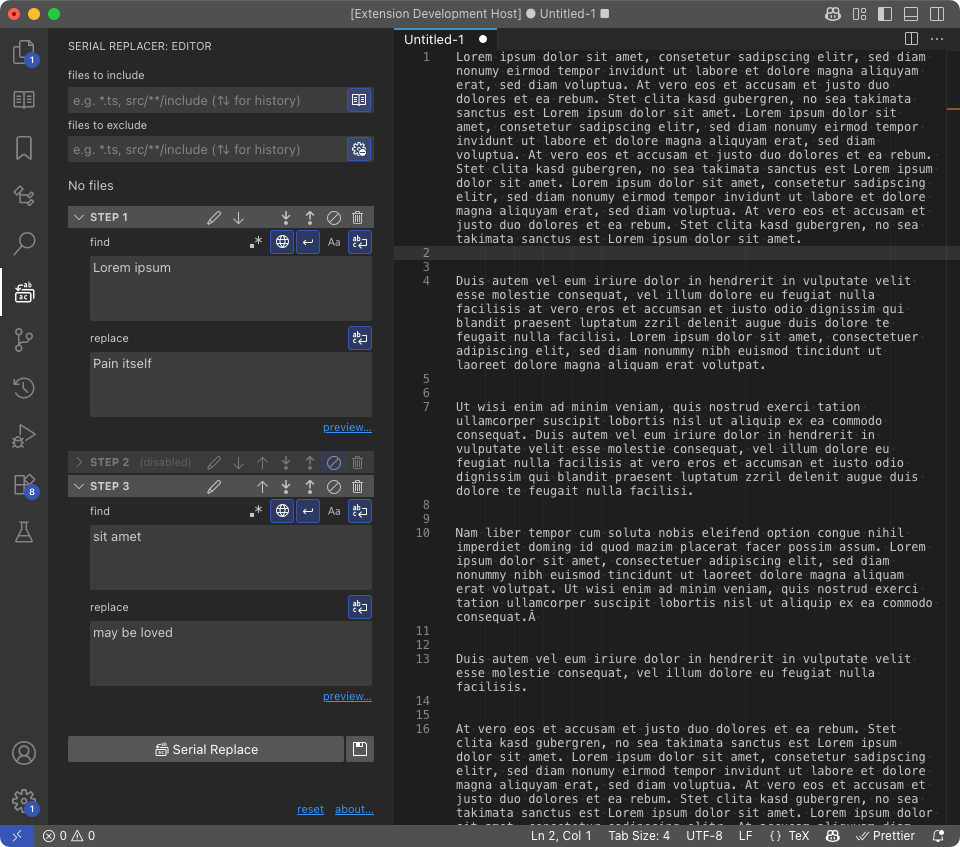

# Serial Replacer

> Visual Studio Code extension that provides a powerful find-and-replace solution. It allows you to perform consecutive replacements by defining steps with search patterns — either regular expressions or plain text — and substitution text. It works across open editors, multiple folders, or entire workspaces.

## Features

- File filters
  - Files to include (using patterns)
  - Files to exclude (using patterns)

- Multiple steps
  - Add step above and bellow
  - Move steps up and down
  - Disable and delete
  - Rename step title
  - Find/replace textarea wordwrap

- Find
  - Use regular expression
  - Find all occurrences (global)
  - Search across lines (multiline)
  - Case sensitive

- Internationalization
  - Brazilian Portuguese

## Bugs

- Performance when working with a large set of files
- ✓ files to include/exclude hangs (because of the controlled component)
- when moving panels loses context (like file filters)
- Multiline does not work; does it make sense? remove it?

## Roadmap

- Webview (frontend)
  - ✓ UI (React)
  - ✓ Icons
  - ✓ File tree with actions
  - Semi-persistent data (e.g.: when change panels)

- Extension (backend)
  - ✓ Bi-direction communication
    - ✓ From webview to extension
      - ✓ file filters
    - ✓ From extension to webview
      - ✓ file tree
  - ✓ Make replacement
  - Preview
  - About
  - Commands
  - Settings

- Integrated (frontend + backend)
  - ✓ Get files and folders
  - ✓ Rename step
  - Sets: data persistance (save/load/rename)
  - ✓ …

- Docs
  - Final screenshot (animated)
  - Tutorial and features

- Publish

- **Future:**
  - Replacements preview (using treeview, panels and diff)
  - Multiple instances (panels)

## More info

[Visual Studio Marketplace]()

[Github](https://github.com/lexblagus/vscode-serial-replacer)
