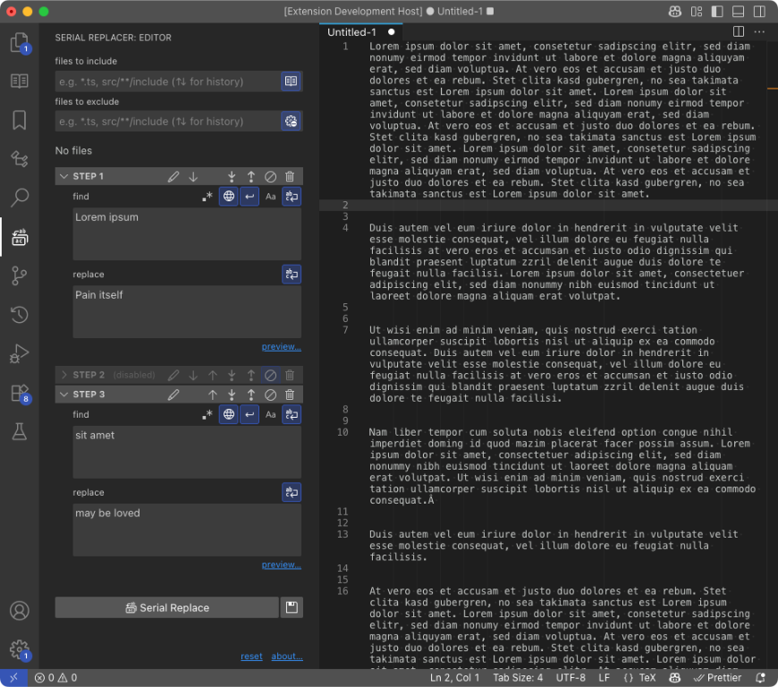

# Serial Replacer

> Visual Studio Code extension that provides a powerful find-and-replace solution. It allows you to perform consecutive replacements by defining steps with search patterns — either regular expressions or plain text — and substitution text. It works across open editors, multiple folders, or entire workspaces.

## Features

- File filters
  - Files to include (using patterns)
  - Files to exclude (using patterns)

- Multiple steps
  - Add step above and below
  - Move steps up and down
  - Disable and delete
  - Rename step title
  - Find/replace textarea wordwrap

- Find
  - Use regular expression
  - Case sensitive
  - Preview file tree

- Internationalization
  - Brazilian Portuguese

## Roadmap

- Webview (frontend)
  - ☑ UI (React)
  - ☑ Icons
  - ☑ File tree with actions
  - ☑ Semi-persistent data (e.g.: when change panels)
  - ☑ Better log (replace console, use config for levels)

- Extension (backend)
  - ☑ Bi-direction communication
    - ☑ From webview to extension
      - ☑ file filters
    - ☑ From extension to webview
      - ☑ file tree
  - ☑ Make replacement
  - ☐ About
  - ☐ Commands
  - ☐ Settings

- Integrated (frontend + backend)
  - ☑ Get files and folders
  - ☑ Rename step
  - ☐ Sets: data persistance (save/load/rename)
  - ☑ Preview
    - ☑ Tree
    - ☑ Count badges
    - ☑ Open
  - ☑ Shared libs
  - ☑ Shared types
  - ☑ Data persistance on reload
  - ☑ Up/down keys for field history
  - ☐ …

- ☐ Tests
  - ☐ Unitary
  - ☐ E2E
  
- ☐ Docs
  - ☐ Final screenshot (animated)
  - ☐ Tutorial and features

- ☐ Publish
  - ☐ Code review
  - ☐ Encapsulate
  - ☐ Metrics?
  - ☐ …

- **Future:**
  - ☑ Replacements preview (using treeview, panels and diff)
  - ☑ Multiple instances (panels)

## Bugs

- ☐ Performance when working with a large set of files
- ☐ Performance when using field history
- ☑ Preview: opens tabs without asking while changing find & replace. Must refactor good part of serialReplacer.ts
- ☑ files to include/exclude hangs (because of the controlled component)
- ☑ when moving panels loses context (like file filters)
- ☑ Multiline does not work; does it make sense? remove it?
- ☑ Preview is not always updated (requires refresh sometimes)
- ☑ Eval inputs that still need debouce (like find and replace fields)

## More info

Project started at April 21st 2025

[Visual Studio Marketplace]()

[Github](https://github.com/lexblagus/vscode-serial-replacer)
					